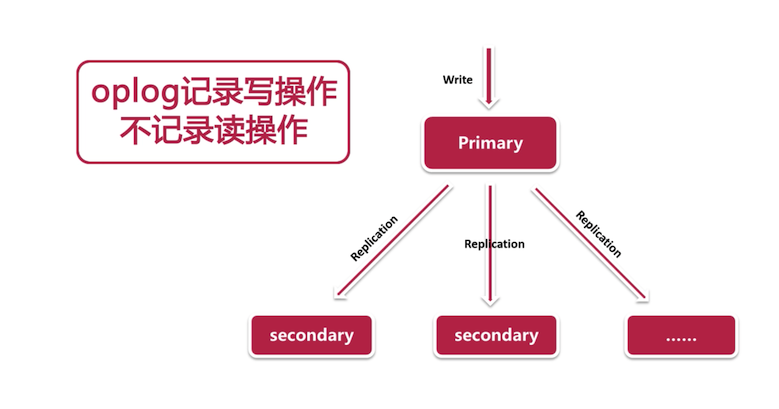

 1、复制集是mongodb中很基础、很重要的集群结构， 它的优势在于`提供数据冗余的`同时，也增加了`高可用` 。
 而且在 sharding( 分片 ) 中扮演者不可或缺的角色。

 2、复制集

 复制集介绍

 第一节:

 单点模式的优点
 
我的:
1、搭建简单
2、数据存储量小

老师:
1、首先，单点模式部署比较简单
2、其次，单点模式会很节省资源，尤其是在生产环境下

单点模式可能引发的问题:

1. 硬盘报警啦，原因是存储空间就要满啦，怎么办 ?
2. 如果出现网络通信或者是机房电力故障，服务器无法正常提供服务怎么办 ? 
3. 进行备份时，为了保证数据的一致性，要将实例关闭或者上一个写锁来保证备份的有效性，这时怎么办 ? 

以上是单点模式的劣势。

1、复制集概念

 1、复制集是从传统主从结构 MASTER/SLAVE  演变而来
 2、复制集是由一组拥有相同数据集的 mongod 实例所组成的集群

 在它的节点中，其中有一个数据节点为主节点，也就是`primary`，所有的写请求都是在这个上完成的。
 而其他的数据节点都是从节点。也就是`secondary`，从节点接受从主节点上传来的操作并应用，并以此保证和主节点的一致性。

 不难看出，复制集是通过`复制`来实现数据的冗余，从而提高数据的可靠性。

2、复制集的两类节点
  1、数据节点：存储数据，可以充当主从节点，强大
  2、投票节点：负责选举，不存储数据，不能充当主从节点 

 主节点接送来自客户端的写操作，一个复制集只能有一个主节点，主节点把所有数据集的变动记录到`oplog`中( oplog 记录写操作，不记录读操作 )，而从节点是根据主节点的`oplog`

 来进行复制操作，在复制集中，只有一个主节点可以接受写操作，这点mongodb 和 mysql 是不一样的，mysql 的从库虽然可以设置`readonly`，但是拥有 super 权限的用户依旧可以进行写操作

 而mongodb 的从库是一定不可写入的。减少人为的干预的可能性，从数据一致性上得到了保证。

